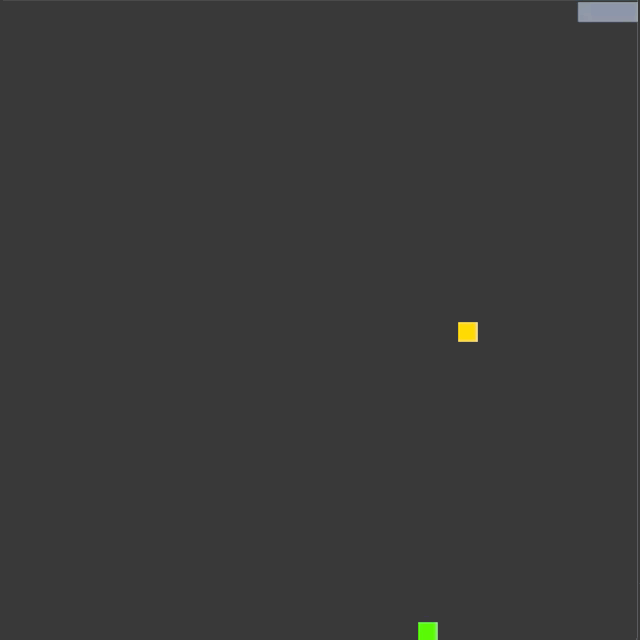

# CPPND: Capstone Snake Game Example

This is a starter repo for the Capstone project in the [Udacity C++ Nanodegree Program](https://www.udacity.com/course/c-plus-plus-nanodegree--nd213). The code for this repo was inspired by [this](https://codereview.stackexchange.com/questions/212296/snake-game-in-c-with-sdl) excellent StackOverflow post and set of responses.

This project is an extension of the traditional 2D Snake game. It adds a level of challenge to the snake's movement by introducing a rival character or mongoose, which can kill the snake if faced head to head.

The mongoose is shown moving around in a spiral pattern towards the center of the window, then back out towards the edge of the window, and repeat. The mongoose is shown in gray and has a fixed size and speed of movement.

The snake is shown moving around in a direction specified by the user with arrow keys. The goal of the game is for the snake to stay away from the mongoose or kill it, get food, and grow. Every time the snake grows, the user scores a point.

The snake can kill the mongoose if it's head runs (or bites) into the mongoose's body except the head. If the mongooose's head runs (or bites) into the snake's head, the snake is killed and the game is over.

If the mongoose is killed, the snake can still chase food, grow in size, and score points. However, if the snake is killed, the game is over and the user will have to launch the game again.

Another level of challenge to the snake's movement is, the speed of the snake increases as it eats food and grows. Therefore, the user must be careful in moving the snake around and ensure the snake does not run into its own body.

## Dependencies for Running Locally
* cmake >= 3.7
  * All OSes: [click here for installation instructions](https://cmake.org/install/)
  * make >= 4.1 (Linux, Mac), 3.81 (Windows)
  * Linux: make is installed by default on most Linux distros
  * Mac: [install Xcode command line tools to get make](https://developer.apple.com/xcode/features/)
  * Windows: [Click here for installation instructions](http://gnuwin32.sourceforge.net/packages/make.htm)
* SDL2 >= 2.0
  * All installation instructions can be found [here](https://wiki.libsdl.org/Installation)
  * Note that for Linux, an `apt` or `apt-get` installation is preferred to building from source.
* gcc/g++ >= 5.4
  * Linux: gcc / g++ is installed by default on most Linux distros
  * Mac: same deal as make - [install Xcode command line tools](https://developer.apple.com/xcode/features/)
  * Windows: recommend using [MinGW](http://www.mingw.org/)

## Basic Build Instructions

1. Clone this repo.
2. Make a build directory in the top level directory: `mkdir build && cd build`
3. Compile: `cmake .. && make`
4. Run it: `./SnakeGame`.

## File Structure for Developers

* #### Main function - `main.cpp`

  1. Declare and define game rendering parameters i.e.
      - Frames per second (FPS)
      - Milliseconds per frame
      - Game screen dimensions
      - Game grid dimensions
  2. Declare and define shared pointers for head coordinates and vector of body cells  
      - Shared pointers are passed to _game.cpp_ and then between _snake.cpp_ and _mongoose.cpp_
      - The memory pointed to by these shared pointers has the current value of the rival's head cell and body cells
      - Therefore, when the game is executing _Snake::Update_, the function uses mongoose's location and vice-a-versa
      - The location of the rival's head and body is used to determine if the snake has killed the mongoose or vice-a-versa
  3. Create _Controller_, _Game_, and _Renderer_ objects to input, update and render the game, respectively

* #### Game Rivals - `rival.h` and `rival.cpp`

  1. Abstract class interface _Rivals_ which provides the framework for game rivals
  2. Declare and define physical parameters i.e. size and head & body cell coordinates
  3. Declare and define movement parameters i.e. speed and direction
  4. Declare and define health status parameters i.e. alive and growing
  5. Declare _pure virtual functions_ for updating the rival parameters
  6. Declare global variables for game _mutex_ and _condition\_variable_

* #### Snake - `snake.h` and `snake.cpp`

  1. Public inheritance of _Rivals_ class to create a class _Snake_ for snake as rival
  2. Declare and define physical parameters i.e. size and head & body cell coordinates
  3. Declare and define movement parameters i.e. speed and direction
  4. Declare and define health status parameters i.e. alive and growing
  5. Override _virtual functions_ for updating the rival parameters
  6. Declare and define a _lock\_guard_ instance and lock the game _mutex_  
      - Update the snake head cell and body cells under the lock, and check whether snake is alive or killed
      - Update the memory for rival's head cell and body cells, pointed to by the shared pointers defined in _main.cpp_ and passed to _Snake::Update_, with snake's head cell and body cells
      - Notify the asynchronous execution of _Snake::Update_ started by _game.cpp_, with game's _condition\_variable_ that rival head cell and body cells have been updated and the game can acquire the lock

* #### Mongoose - `mongoose.h` and `mongoose.cpp`

  1. Public inheritance of _Rivals_ class to create a class _Mongoose_ for mongoose as rival
  2. Declare and define physical parameters i.e. size and head & body cell coordinates
  3. Declare and define movement parameters i.e. speed and direction
  4. Declare and define health status parameters i.e. alive and growing
  5. Override _virtual functions_ for updating the rival parameters
  6. Declare and define a _lock\_guard_ instance and lock the game _mutex_  
      - Update the mongoose head cell and body cells under the lock and check whether mongoose is alive or killed
      - Update the memory for rival's head cell and body cells, pointed to by the shared pointers defined in _main.cpp_ and passed to _Mongoose::Update_, with mongoose's head cell and body cells
      - Notify the asynchronous execution of _Mongoose::Update_ started by _game.cpp_, with game's _condition\_variable_ that rival head cell and body cells have been updated and the game can acquire the lock 

* #### The Game - `game.h` and `game.cpp`

  1. Define global variables for game _mutex_ and _condition\_variable_
  2. Run the input, update and render loop indefinitely or till the snake dies
  3. Kick off Uniform Random Number Generator to place food within the grid dimensions and away from snake and mongoose
  4. Declare _future_ variables for snake and mongoose and kick off asynchronous execution of their _Update_ function
  5. Declare and define a _unique\_lock_ instance and lock the game _mutex_, but block the asynchronous task and release the game _mutex_ until the memory pointed to by the shared pointer has been updated and the _wait_ for game's _condition\_variable_ has been _notified_
  6. If the snake "ate" the food, replace the food, increase the score, increase the speed, and grown the body. However, if the mongoose "ate" the food, just replace the food.

* #### The Renderer - `renderer.h` and `renderer.cpp`

  1. Since the _Renderer_ object requires custom destructor, _Rule of Five_ has been implemented and a copy constructor, copy assignment operator, move constructor and move assignement operator have also been defined
  2. Declare and define the main render function to render the snake body, mongoose body and food using SDL
  3. Display information message window when mongoose and snake instance is killed or destroyed 

* #### The Controller - `controller.h` and `controller.cpp`
  1. get key inputs from the up, down, left and right arrow keys
  2. change snake head's direction based on user's inputs